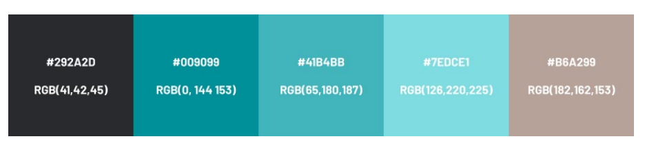

# devoir_3_maquette_probeats_figma

## Consignes :
  * Le client souhaite des visuels pleine page,
  * Le header doit inclure le logo et un menu de navigation,
  * Le menu doit inclure des liens vers les produits, la page A propos, la page Assistance, le panier et la connexion,
  * Le footer doit inclure l’ensemble des pages et les mentions légales, ainsi qu’une partie contact et réseaux sociaux,
  * Utilisez des pictogrammes adéquats en téléchargeant une librairie d’icônes via https://www.figma.com/community/tag/icons
  * Vous pouvez utiliser du faux texte ou Lorem Ipsum, disponible sur www.lipsum.com,
  * Les blocs de contenu (comprenant textes, listes, boutons) doivent s’adapter à la grille et posséder un padding de 24px
  * Le résultat de votre travail devant servir de support à une présentation au client, vous devez prévoir et formaliser l'enchaînement des écrans (prototype)

## Etapes pour la restitution de votre devoir : 

  1.  Je prends connaissance du brief de ma mission
  2. Je prends connaissance des annexes utiles à la réalisation de mon devoir
  3. Le livrable attendu est un lien repository GitHub du projet. Ce projet (au format .fig), contiendra, en version desktop et mobile :
    * La page d'accueil (maquette),
    * La page Produit (wireframe),
    * La page Commande (wireframe),
    * La page A propos (wireframe),
    * La page Assistance (wireframe).
    * Les styles et les composants créés devront également être présents.

## Cahier des charges

### Le client 

Probeats est une marque qui a été créée en 2020. Elle n’a encore aucune part sur le marché
de l’audio, et n’a pour l’heure vendu aucun produit.
Les tests en laboratoire viennent d’être confirmés et les produits sont prêts à être
commercialisés.
Cette nouvelle marque, à la pointe de la technologie, souhaite s’implanter sur le marché audio
en se positionnant comme futur leader des appareils auditifs sans fil.
Elle mise sur une haute-qualité d’écoute et une performance longue durée. Elle s’adresse à une
cible jeune et mobile.

### La mission

La société Probeats est une nouvelle marque de matériel audio qui promeut une expérience
sonore Ultra-Haute-Qualité et immersive en proposant des produits toujours plus innovants.
Pour débuter son activité commerciale, elle souhaite mettre en place un site e-commerce
proposant ses trois produits phares :
  * Le casque audio
  * L’enceinte Bluetooth
  * L’enceinte studio
Probeats vous a contacté pour créer son site e-commerce et vous sollicite dans un premier
temps pour la validation de la maquette de leur futur site internet.

### Fonctionalités du site

#### Le site doit proposer les fonctionnalités suivantes :

  * Achat
  * Inscription / Connexion
  * Contact et assistance
  * Liens vers les réseaux sociaux

#### Le site comportera 5 pages :

  1. Page d'accueil
    * Mise en avant du produit phare : le casque audio,
    * Ligne incluant les deux autres produits,
    * Diaporama de recommandations clients ou extraits d'articles

  2. Page Produit
    * Bloc produit avec sa photo, son nom, sa description, son prix et un bouton
    d’achat,
    * Un autre bloc de description avec un slogan et une image d’ambiance,
    * 3 caractéristiques en colonne.

  3. Page Commande
    * Récapitulatif de la commande,
    * Informations de livraison et de paiement.

  4. Page A propos
    * L’histoire de la création de la marque,
    * Présentation des points forts de l'entreprise.
  
  5. Page Assistance
    * Les services de l’entreprise,
    * Une FAQ.

#### Toutes les pages auront un header et un footer commun
#### Le client souhaite un visuel pleine page

### L’IDENTITÉ GRAPHIQUE

#### Polices
La police à utiliser sur le site est la Barlow (disponible nativement sur Figma ou téléchargeable
ici : https://fonts.google.com/specimen/Barlow). 

    * Bold
    * Regular
    * Thin
    * Italique

Les tailles de police devront s’adapter à la taille définie par l’utilisateur dans le navigateur. 

#### Images

  1. Le logo
    

  2. Le favicon
    

  3. les produits 

#### Palette de couleurs 

Le blanc (#FFFFFF) pourra également être utilisé.

## Maquette wireframe and prototype

[Figma-maquette](https://www.figma.com/design/H1IdnujVVquJEjwXNf8TZa/Probeats-devoir3?node-id=5-2428&t=n2rjX72DxppGxW7D-0)

